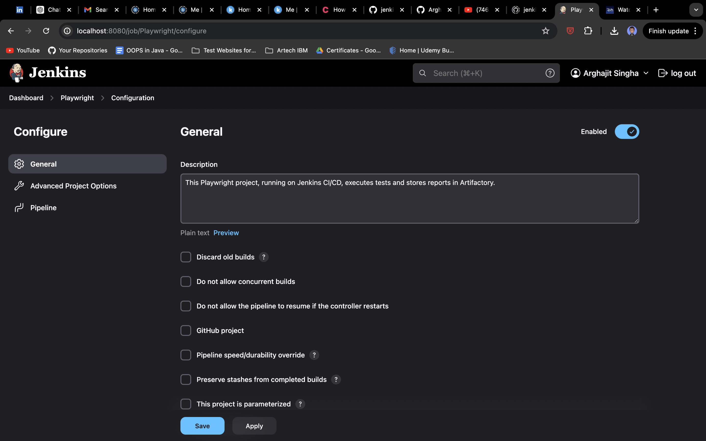

# Playwright Automation testing in Jenkins CI/CD

## Steps to Set Up Playwright

1. **Install Node.js**: Ensure that Node.js is installed on your system, as Playwright depends on it.

2. **Initialize Playwright**: Use the following command to install Playwright:

   ```bash
   npm init playwright@<version>
   ```
   Replace `<version>` with the desired version. If omitted, the latest version will be installed.

3. **Project Configuration**: During the setup, select the "JavaScript" option as this project uses Playwright with JavaScript.

4. **Run Tests**: Execute the following command to run Playwright tests in headed mode:

   ```bash
   npx playwright test <testFileName> --headed
   ```
   Replace `<testFileName>` with the name of the test file you wish to execute.


## How to setup Playwright Pipeline with Jenkins

1. First, run jenkins in your local or, in as a docker image. It by default opens in <a href="http://localhost:8080">localhost:8080</a>.
2. Go to Manage Jenkins > Plugins > Available Plugins and install NodeJS Plugin
3. Go to Manage Jenkins > Tools > NodeJS Installation > Setup.
4. Go to Dashboard > New Item > Pipeline > <Name_Pipeline> > Save
5. Now in the config file configure the following these steps:

    I. 
    II. 
    III. 
    IV. 
    V. Apply and Save.

6. Now Manually Hit the Build Now button and Sit back & Relax.

7. Now as I was having some issues with jenkins, running directly from commands, so I have created a `command.sh` file, where I have give all the commands at the same time.

8. Then create a JenkinsFile:
```
pipeline {
  agent any
    tools {
        nodejs "node" // Ensure this matches the NodeJS installation name configured in Jenkins
    }
  stages {
    stage('Install playwright and running tests') {
      steps {
        sh '''
            chmod +x command.sh
            ./command.sh
        '''
      }
    }
    stage('Reporting') {
      steps {
        sh '''
          echo "Generating Reports! Yup all the test cases are executed."
        '''
      }
      post {
        always {
            // Uploading artifacts
            archiveArtifacts artifacts: 'playwright-report/**/*', allowEmptyArchive: true
        }
      }
    }
  }
}
```
